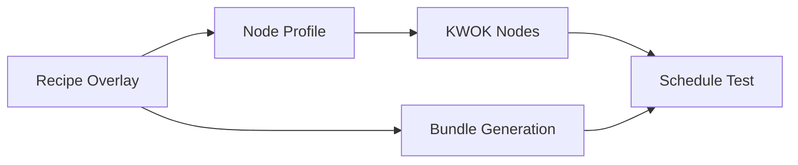

# KWOK-Based Cluster Simulation

KWOK (Kubernetes WithOut Kubelet) tests AICR bundles against simulated GPU clusters without real hardware.

## Prerequisites

Versions are pinned in `.settings.yaml`. **Docker Desktop must be running** — Kind uses it to create the local cluster.

```bash
# Kind, lifecycle, bundle deployment, build
brew install kind tilt-dev/tap/ctlptl helm yq goreleaser
```

The `kwok`/`kwokctl` binaries are not required — `make kwok-cluster` installs the KWOK controller into the cluster via `kubectl apply`.

> If `GITLAB_TOKEN` is set, `make build` will fail. Run `unset GITLAB_TOKEN` first.

## Quick Start

Run from the repo root:

```bash
unset GITLAB_TOKEN
make build

# Test a single recipe
make kwok-e2e RECIPE=h100-eks-ubuntu-training-kubeflow

# Test all recipes (sequential, shared cluster)
make kwok-test-all
```

## Architecture

Cluster configuration is inferred from recipe overlays — no separate config files needed.



**Components:**

| Component | Location | Purpose |
|-----------|----------|---------|
| Recipe Overlays | `recipes/overlays/*.yaml` | Define cluster criteria (service, accelerator) |
| Node Profiles | `kwok/profiles/{provider}/*.yaml` | Hardware specs per instance type |
| Scripts | `kwok/scripts/` | Create nodes, validate scheduling |
| CI Workflow | `.github/workflows/kwok-recipes.yaml` | Auto-discover and test recipes |

## Profile Selection

Selection happens in two steps: normalize the recipe criteria, then match
profiles against the normalized values.

**1. Criteria normalization.** `resolve_recipe_criteria` in
`kwok/scripts/lib/profile-select.sh` reads
`spec.criteria.{service,accelerator}` from the overlay and applies:

| Input value | Normalized to |
|-------------|---------------|
| missing / `null` — `service` | `eks` |
| `any` — `service` | `eks` |
| missing / `null` — `accelerator` | `h100` |
| `any` — `accelerator` | `h100` |
| any other value | passed through verbatim |

Both `apply-nodes.sh` (direct path) and `run-all-recipes.sh` (batch path)
call this same resolver, so the two entry points cannot drift on how
placeholder values collapse.

**2. Profile matching.** The normalized `(service, accelerator)` pair is
then looked up under `kwok/profiles/<service>/` by matching each
candidate's `metadata.labels`:

| Role | Match rule |
|------|------------|
| system | `provider == <service>` and `nodeType == system` |
| gpu | `provider == <service>` and `nodeType == accelerated` and `accelerator == <accelerator>` |

Exactly one match per role is required. There is no silent fallback to
another provider (see #1997). The selector distinguishes two failure
classes so batch mode can be forgiving about coverage without hiding
tree faults:

- **No match** (zero matching profiles for `(service, accelerator)`) —
  the recipe is out of scope for what is currently on disk. This
  covers both an unknown service (its `kwok/profiles/<service>/`
  directory doesn't exist) and an unknown accelerator (the directory
  exists but has no `accelerated` profile carrying that label).
  Selector returns `PROFILE_SELECT_RC_NO_MATCH` (2); how the caller
  treats it depends on the entry point (see below).
- **Ambiguous or invalid** (multiple matching profiles, malformed
  profile YAML, or a profile whose `metadata.labels.provider` label
  disagrees with its parent directory) — always a hard error (rc=1),
  never skippable. All three are real tree faults the caller must
  surface; a mislabeled file that happens to be the sole profile for
  its role would otherwise silently degrade to a no-match and zero
  coverage without warning.

Selection is implemented in `kwok/scripts/lib/profile-select.sh` and
unit-tested by the sibling `profile-select_test.sh` (wired into the
`kwok-recipes.yaml` discover job).

**Entry-point behavior on `no match`.** The three entry points treat
rc=2 differently — a recipe you can't test isn't the same as a recipe
that failed, but explicit user asks must never silently do nothing:

| Entry point | Behavior on `no match` (rc=2) | Behavior on `ambiguous/invalid` (rc=1) |
|-------------|-------------------------------|----------------------------------------|
| Direct: `apply-nodes.sh <recipe>` / `make kwok-e2e RECIPE=...` | **Fail closed** with the full diagnostic — user named a specific recipe. | Fail closed. |
| Implicit batch: `run-all-recipes.sh` / `make kwok-test-all` | **SKIP with WARN** so backfilling profiles doesn't turn every batch red. | Fail closed (batch cannot mask a broken tree). |
| CI matrix: `.github/workflows/kwok-recipes.yaml` | **DROP at classify** (`::notice`), never dispatched — the tier-2/3 cell would otherwise report green without validating anything. `workflow_dispatch` of a specific recipe **fails closed** (explicit ask). | Fail closed at classify. |

Currently on disk:

| Service | Accelerator | System profile | GPU profile |
|---------|-------------|----------------|-------------|
| eks | h100 | `eks/system-m7i.yaml` | `eks/p5-h100.yaml` |
| eks | gb200 | `eks/system-m7i.yaml` | `eks/p6-gb200.yaml` |

**Cluster defaults:** 2 system nodes, 4 GPU nodes (32 GPUs), Kubernetes v1.33.5, region `us-east-1`.

## Makefile Targets

| Target | Description |
|--------|-------------|
| `make kwok-test-all` | Test all recipes in shared cluster (serial) |
| `make kwok-e2e RECIPE=<name>` | Full e2e: cluster, nodes, validate |
| `make kwok-cluster` | Create Kind cluster with KWOK |
| `make kwok-nodes RECIPE=<name>` | Create simulated nodes |
| `make kwok-nodes-delete` | Delete all KWOK-simulated nodes |
| `make kwok-test RECIPE=<name>` | Validate scheduling only |
| `make kwok-test-deployer RECIPE=<name> DEPLOYER=<d>` | Validate under a GitOps deployer lane (`helm`, `argocd-oci`, `argocd-helm-oci`, `argocd-git`, `flux-oci`, `flux-git`) |
| `make kwok-status` | Show cluster and node status |
| `make kwok-cluster-delete` | Delete cluster |

## Deployer Lanes (GitOps Matrix)

The GitOps lanes install shared infrastructure once per cluster via
`kwok/scripts/install-infra.sh` (keyed on `DEPLOYER`): an in-cluster
OCI registry (always), Argo CD (`argocd-*`), Flux 2 (`flux-*`), and
Gitea (the Git-source lanes `flux-git` and `argocd-git`). Two host-port
mappings in `kwok/kind-config.yaml` expose the in-cluster services to
the runner:

| Service | Host port | NodePort | In-cluster DNS | Used by |
|---------|-----------|----------|----------------|---------|
| registry | 5500 | 30500 | `registry.aicr-registry.svc.cluster.local:5000` | `aicr bundle --output oci://localhost:5500/...` (OCI lanes) |
| gitea | 3300 | 30300 | `gitea.aicr-registry.svc.cluster.local:3000` | `git push` of the filesystem bundle (`flux-git`, `argocd-git` lanes) |

Clusters created before a port mapping existed must be recreated
(`kind delete cluster --name aicr-kwok-test`) to pick it up.

Lane details, sync gates, exit codes, and tuning variables are
documented in
[docs/contributor/tests.md](../docs/contributor/tests.md) ("KWOK
Matrix Testing"); design rationale in
[ADR-008](../docs/design/008-kwok-deployer-matrix.md) (OCI lanes) and
[ADR-010](../docs/design/010-kwok-git-source-lanes.md) (Git-source
lanes).

## Adding Recipes

A recipe is auto-discovered for KWOK testing if it has `spec.criteria.service` defined. Create `recipes/overlays/your-recipe.yaml`:

```yaml
kind: recipeMetadata
apiVersion: aicr.run/v1alpha2
metadata:
  name: your-recipe-name
spec:
  base: eks-training
  criteria:
    service: eks        # Required for KWOK testing
    accelerator: h100
    intent: training
  componentRefs:
    - name: gpu-operator
      type: Helm
      valuesFile: components/gpu-operator/values-eks-training.yaml
```

Test it: `unset GITLAB_TOKEN && make build && make kwok-e2e RECIPE=your-recipe-name`.

## Adding Node Profiles or Cloud Providers

Profiles are discovered by label — no script edit is needed. Copy an
existing profile, update `metadata.labels.{provider,nodeType,accelerator}`
and `spec.*`, and drop it under `kwok/profiles/<provider>/`:

```bash
cp kwok/profiles/eks/p5-h100.yaml kwok/profiles/eks/p5-a100.yaml
# then edit metadata.labels.accelerator and spec.gpu.* to match the new instance type
```

For a new cloud provider, create the `kwok/profiles/<provider>/` directory
and add:

- **exactly one** system profile with `metadata.labels.{provider: <provider>, nodeType: system}`, and
- **exactly one** accelerated profile *per supported accelerator* with `metadata.labels.{provider: <provider>, nodeType: accelerated, accelerator: <accelerator>}`.

`select_profiles` requires a unique match in each role and returns a
fatal error (not a skip) on any tree-integrity fault, so all of the
following break both direct invocations and batch CI:

- a duplicate `nodeType: system` under the same provider,
- two profiles carrying the same accelerator label,
- a profile whose `provider` label disagrees with its parent directory
  (e.g. an `eks`-labeled file dropped under `kwok/profiles/gke/`),
- an accelerated profile missing its `accelerator` label,
- a profile whose `nodeType` label is neither `system` nor
  `accelerated` (typos such as `sytem`).

All of these are treated fatally rather than silently skipped — if the
mislabeled file is the sole profile for its role, silent skipping
would zero coverage without a warning (the same coverage-lie #1997
targets, via a different field). `apply-nodes.sh` picks up the new
profiles on the next run.

## CI Integration

`.github/workflows/kwok-recipes.yaml` calls the same `run-all-recipes.sh` used by `make kwok-test-all`. CI uses a single shared Kind cluster with cleanup between recipes.

Manual trigger:
```bash
gh workflow run kwok-recipes.yaml -f recipe=your-recipe-name
```

## Troubleshooting

**Pods stuck Pending** — check tolerations and node selectors:
```bash
kubectl describe pod <pod-name> -n aicr-kwok-test
```
GPU pods need toleration `kwok.x-k8s.io/node=fake:NoSchedule` and selector `nvidia.com/gpu.present: "true"`.

**KWOK controller issues**: `kubectl logs -n kube-system deployment/kwok-controller`

**Recipe not being tested**: verify `yq eval '.spec.criteria.service' recipes/overlays/your-recipe.yaml` is non-empty.

## Limitations

KWOK validates scheduling, not runtime: node selectors, tolerations, resource requests, scheduling decisions, and Helm chart generation are checked. Container execution, GPU functionality, and network connectivity are NOT. For runtime testing, use Tilt (`make dev-env`) or a real cluster.

**OCP recipes are excluded** from KWOK testing. OCP requires the full OpenShift operator ecosystem (OLM and operator controllers) which cannot run in a plain Kind cluster. OCP bundle structure is validated by Chainsaw tests instead.

## Resources

- [KWOK docs](https://kwok.sigs.k8s.io/)
- [Development guide](../DEVELOPMENT.md)
